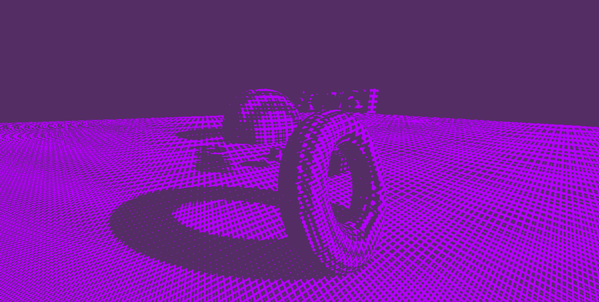

# Surface Stable Fractal Dithering

An implementation of surface stable fractal dithering based off of [this video](https://www.youtube.com/watch?v=HPqGaIMVuLs). One of the main differences with this implementation is that instead of using a single fractal level, it uses three (one for each axis). Instead of using uv coordinates, it uses model space xyz coordinates. By using separate fractal dimensions per axis, some of the issues with oblique viewing angles are solved, however oblique viewing angles along diagonals (i.e. not along axes) still results in squashing of the pattern.

